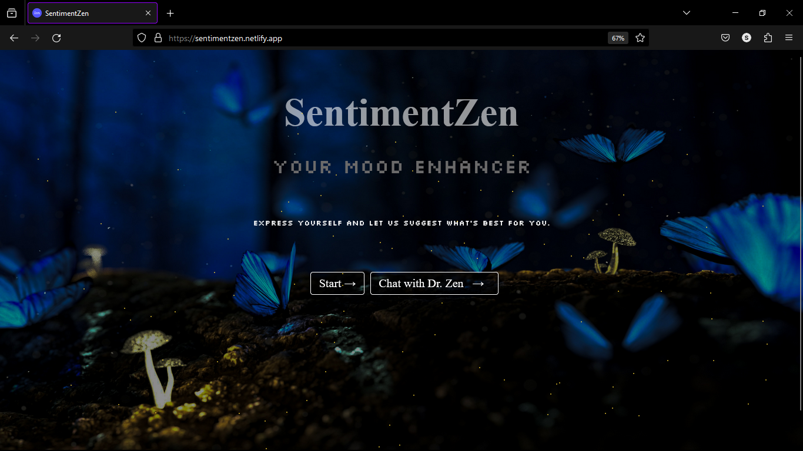
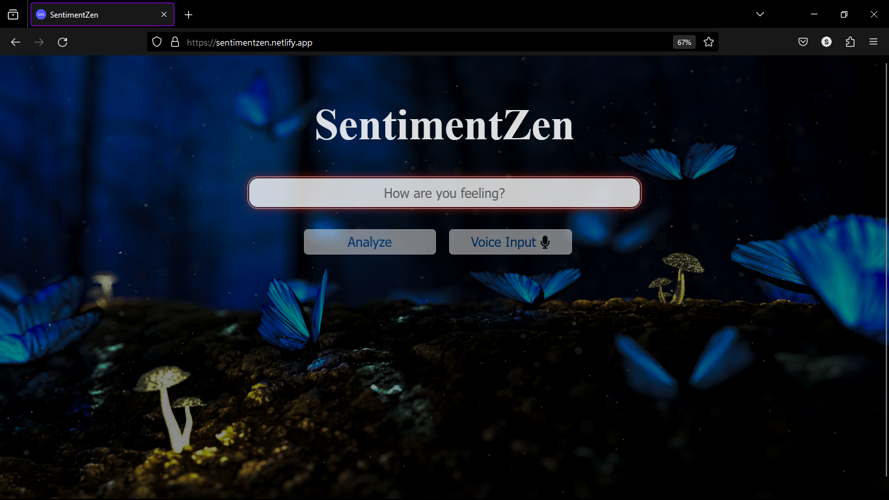
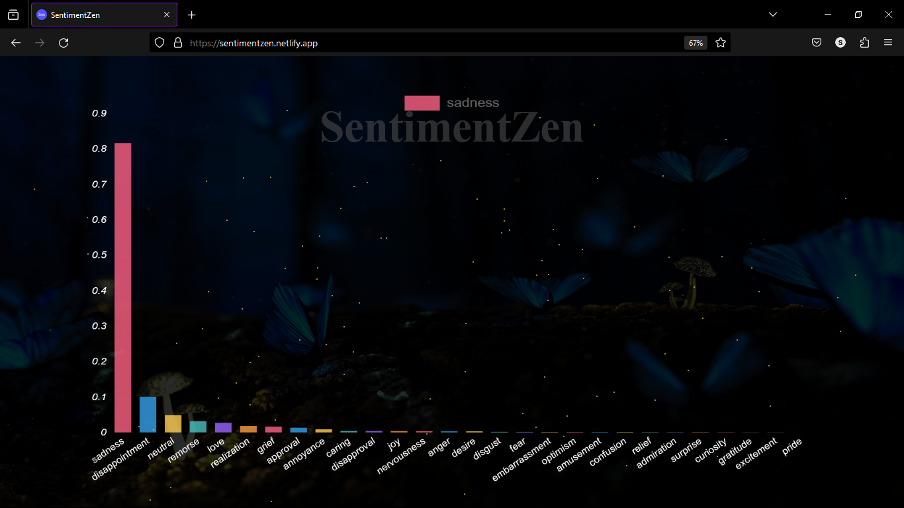
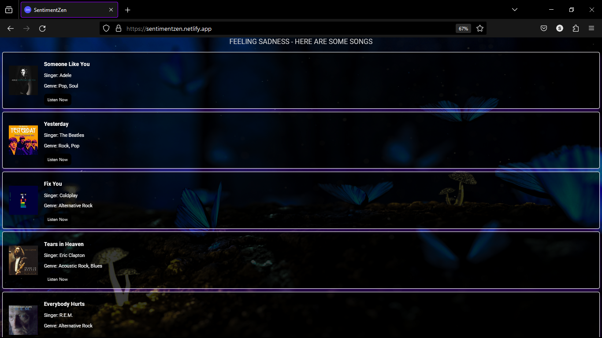

# SentimentZen

SentimentZen utilizes emotion analysis to understand a user's current emotional state based on their input.  Leveraging this data, the platform offers a suite of features to guide users towards a more positive emotional state.

## Features

- **Input Options:** Users can input text directly or use speech input for analysis.
- **Emotion Analysis:** Utilizes the RoBERTa model to analyze the input and detect emotions across 28 different labels.
- **Content Recommendations:** Recommends books, movies, music, and yoga/meditation practices tailored to the user's emotional needs.
- **Interactive Visualization:** Displays the emotional analysis results using a bar chart for easy visualization.
- **Dr. Zen:** An AI-powered therapist chatbot offering personalized support, practical advice, and empathetic listening.


## Tech Stack

**React:** Frontend framework for building the user interface.

**RoBERTa Model:** Pre-trained transformer model from Hugging Face for emotion analysis.

**Chart.js:** JavaScript library for creating interactive charts.

**SpeechRecognition API:** Enables speech input functionality.

**Google Gemini API:** Powering the Dr. Zen feature which is an AI Therapist chatbot.

**Hugging Face Datasets:** Provides the emotion dataset for training and analysis.


## Getting Started

1. **Clone the repository**

```bash
git clone https://github.com/your-username/sentimentzen.git
cd sentimentzen
```
2. **Install dependencies**
```bash
npm install
```

3. **Start the Development Server**

```bash
npm start
```

4. **Start the Development Server**

Open your web browser and navigate to http://localhost:3000 to access the SentimentZen application.
    
## Screenshots









## Authors

- [@saurabhsinghaa](https://www.github.com/saurabhsinghaa)

